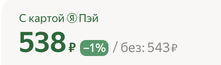
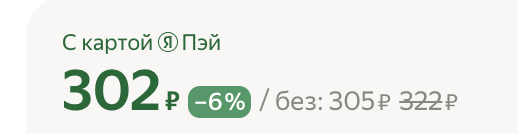
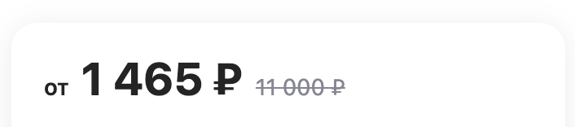
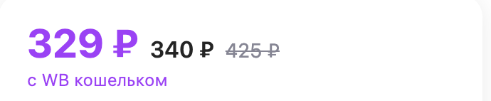

# Парсеры

## Yandex

### Виды цен

**Уточнение:** Скидка по карте Пэй может у разных пользователей отличаться (?)

1. Тип 1 ([Ссылка](https://market.yandex.ru/product--blesk-dlia-gub-le-grand-volume/664040634?sku=100928907750&uniqueId=924574&do-waremd5=TkWAAtMswRA95y8XyphX9g))

- Цена 1: ``468``
- Скидка: ``
–10&thinsp;%
``
- Цена 2: Посчитать через cкидку или получить весь блок через ``
 `` и найти последний span c пустым классом ``521&nbsp;₽``

Самый Родительский div: ``
``
Следующий родительский ``
``
2. Тип 2 ([Ссылка](https://market.yandex.ru/product--influence-beauty-blesk-dlia-gub-plexiglass-lip-gloss-ton-shade-05/1663269245?sku=101598313596&do-waremd5=qQQj7zd0a0xAo-_lhsciQg&showUid=17159736558560672185106002&uniqueId=993469&cpa=1&cpc=PRz2zu4wZJnHLMAhDovzql3cRPbyPHyY47KUTB4BgfB8URJ-_CH74BJ48gd5JEyTHPYvjq8i0qEIKwCNWb76EyNeAroVAiS_RWZodD5Yw8JjB8suN5lnhk9p-PlCN9u0Uyh24NwH_gH8DN-Z0ECogEN9Kl1ZDt5fhQD7KFWTrN10mQ-CNk1W5_jDJfoYSrmYuipRdw6xAkoxlEIxXjrBHqI9vCbFEZbpKYsEr6caVCLup-RPAhyRbV8h88kiX2JtTrknMilLOFB9G2v_lnV9WzXyyR4b_n8AAovsS6eBw7Y%2C&sponsored=1))

- Цена 1: ``<h3 class="Jdxhz" data-auto="snippet-price-current">Цена с картой Яндекс Пэй:538<!-- --> ₽</h3>``
- Скидка: ``
Скидка: 1%
–1&thinsp;%

``
- Цена 2: ``без:<!-- -->&nbsp;Вместо: 543<!-- -->&thinsp;₽``

3. Тип 3 ([Ссылка](https://market.yandex.ru/product--tint-dlia-gub-lip-tint-aqua-gel/1764396919?sku=101799569511&uniqueId=892157&do-waremd5=cw_YDFIVe8cPGR_7QS57rw))

- Цена 1: ``<h3 class="Jdxhz" data-auto="snippet-price-current">Цена с картой Яндекс Пэй:302<!-- --> ₽</h3>``
- Скидка: ``
–6&thinsp;%
``
- Цена 2: ``без:<!-- -->&nbsp;Вместо: 305<!-- -->&thinsp;₽<s class="_347Sb">322</s>&thinsp;₽``
- Цена 3: ``без:<!-- -->&nbsp;Вместо: 305<!-- -->&thinsp;₽<s class="_347Sb">322</s>&thinsp;₽``

## WB

1. Тип 1 ([Ссылка](https://www.wildberries.ru/catalog/64775386/detail.aspx))

- Цена 1: ``//ins[@class="price-block__final-price"]``
- Цена 2: ``//del[@class="price-block__old-price"]``

2. Тип 2 ([Ссылка]())

- Цена 1: ``//span[@class="price-block__wallet-price"]``
- Цена 2: ``//ins[@class="price-block__final-price wallet"]``
- Цена 3: ``//del[@class="price-block__old-price"]``
